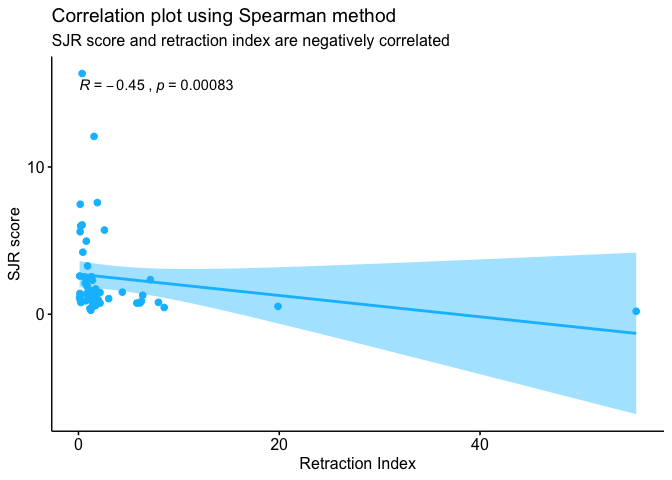
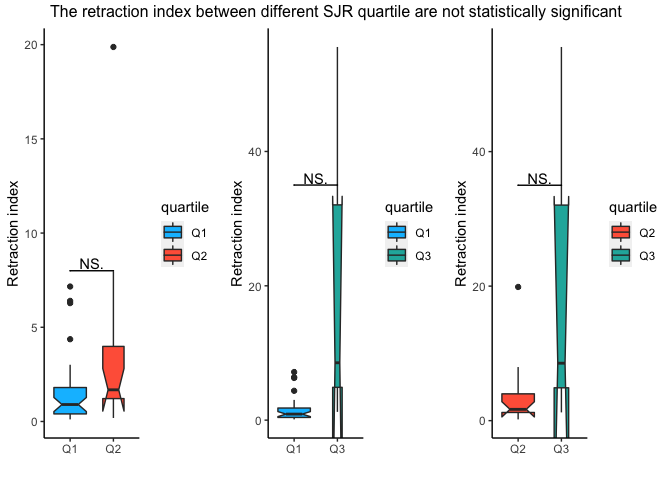

# Introduction

Fang and Casadevall (2011) defined **retracted article** as an article that is no longer considered trustworthy due to intentional misconduct or unintentional human error. In their study, they found **positive correlation** between the journal's retraction index with the Journal Impact Factor (JIF). Steen (2011) also did similar study and concluded that retracted articles are more likely to be published in journals with a high JIF.

In this exploration, I would like to check whether correlation can also be found between retraction index to another journal metric called Scimago Journal Ranking (SJR). The main benefit of using SJR over JIF is that SJR score has been normalized to enable comparison between different subject areas.

**Retraction index** here is calculated by multiplying the number of retraction notices for each journal during a given time (2009 to 2018) by 1,000, and dividing it by the number of articles published by the journal during the same time period. This definition is adapted from Fang and Casadevall (2011).

# Data sources

PubMed indexes retraction notices and these can be retrieved freely via their API. The dataset used for this exploration was retrieved on October 2019.

SJR score is available publicly at https://www.scimagojr.com/, and for this exploration the 2018 edition is used. 


```r
library(tidyverse)
library(tidyverse)
library(highcharter)
library(xml2)
library(XML)
library(purrr)
library(plyr)
library(stringr)
library(ggpubr)
library(ggsignif)
```

# Data import and clean up

## PubMed

The retraction notices (in XML format) are retrieved from PubMed database using the following search term **"retraction of publication"[PTYP]**.


```r
getXML <- function(ptyp) {
  require(rentrez)
  es <- entrez_search("pubmed", paste(ptyp, "[PTYP]", sep = ""), use_history = TRUE)
  ef <- entrez_fetch("pubmed", web_history = es$web_history, retmax = es$count, rettype = "xml")
  return(ef)
}

ret_of <- getXML("\"Retraction of Publication\"")

writeLines(ret_of,useBytes = TRUE,"D:/R test/retraction/retractionOf.xml")
```


```r
ret_of <- read_xml("D:/R test/retraction/retractionOf.xml")
```

The following information will be extracted from the XML file:

* Journal title

* ISSN

* Publication year

Subsequently, the number of retraction notices from each journal for the period specified above (2009 to 2018) is calculated.


```r
#journals
journalsToCSV <- function(xmlfile) {
  require(rentrez)
  require(xml2)
  require(dplyr)
  require(tibble)
  require(readr)
  
  extract_info <- function(x){
    title <- x %>% xml_find_first("./ISOAbbreviation") %>% xml_text
    issn <- x %>% xml_find_first("./ISSN") %>% xml_text
    py <- x %>% xml_find_first("./JournalIssue/PubDate/Year") %>%
      xml_text %>% as.numeric()
    
    df <- data.frame(title, issn, py)
    
    return(df)
  }
  
  journals_cnt <- read_xml(xmlfile) %>% 
    xml_find_all("//MedlineCitation/Article/Journal") %>% 
    extract_info %>% 
    group_by(title,issn,py) %>% 
    count(title) %>% 
    filter(n >= 5 ) %>% 
    rename(count = n)
  
  return(journals_cnt)
  
}

ret_journals <- journalsToCSV("D:/R test/retraction/retractionOf.xml")

subset <- ret_journals %>% 
  filter(py > 2008 | py != 2019)

subset2 <- subset %>% 
 group_by(title,issn) %>% 
  summarise(total_count=sum(count))

write.csv(subset2, "D:/R test/retraction/subset.csv")
```

The following code will search for the **total number of publications** published by the above journals from the same time period, 2009 to 2018.


```r
subset2 <- read.csv("D:/R test/retraction/subset.csv")

tot_journals <- tibble()

for(j in 1:length(subset$title)) 
  {
  for(y in 2009:2018) {
    
    journal <- paste("\"", subset$title[j],"\"","[JOUR]", sep = "")
    year <- paste(y,"[EDAT]", sep = "")
    
    total <- entrez_search("pubmed", paste(journal, "AND ", year, sep = " "))
    
    Sys.sleep(3)
    
    x <- data.frame("title" =as.character(subset$title[j]), 
                    "issn" = as.character(subset$issn[j]),
                    "year" =  y,
                    "total" = as.numeric(subset$count))
    tot_journals <- bind_rows(tot_journals,x)
    
      }
  
}

write.csv(tot_journals,"D:/R test/retraction/total_journal.csv" )

tot_journals2 <- tot_journals %>% 
  dplyr::group_by(issn) %>% 
  dplyr::summarize(total_pub=sum(total))

dat <- left_join(subset2, tot_journals2, by="issn") 
  
write.csv(dat,"D:/R test/retraction/subset_retract_of.csv" )
```

Subsequently, the retraction index can be calculated. 


```r
dat <- read.csv("~/Documents/nBox/R/retraction/subset_retract_of.csv")

dat <- dat %>%
  mutate(rate = round(((1000 * total_count)/total_pub), 3)) %>%
    arrange(desc(rate))
```

## SJR 

The SJR metrics downloaded from https://www.scimagojr.com/ requires some wrangling.


```r
sjr <- read.csv("~/Documents/nBox/R/retraction/sjr.csv") %>% 
  filter(Type == "journal") %>% 
  select(c(Title,Issn,SJR.Best.Quartile, SJR)) 

sjr_edit <- sjr %>% 
  separate(Issn, c("issn1","issn2"), sep = "\\,", remove = TRUE) %>%
  mutate(issn1 = str_pad(issn1, 8, side = c("left"), pad = "0"),
         issn2 = str_pad(issn2, 8, side = c("left"), pad = "0")) %>% 
  mutate(issn2 = str_trim(issn2, side = c("left"))) %>% 
  mutate(issn1 = sub("(.{4})(.*)", "\\1-\\2", issn1), 
         issn2 = sub("(.{4})(.*)", "\\1-\\2", issn2))
```

## Combined the 2 datasets 


```r
#match the data using title

combined <- left_join(dat, sjr_edit, by = c("issn" = "issn1")) 

combined2 <- left_join(combined, sjr_edit, by = c("issn" = "issn2"))

combined3 <- combined2 %>% 
  mutate(quartile = coalesce(SJR.Best.Quartile.x,SJR.Best.Quartile.y),
         sjr=coalesce(SJR.x,SJR.y)) %>%
  select(title,issn,total_count,total_pub,rate,quartile,sjr) %>% 
  mutate(sjr=gsub("\\,","\\.",sjr))%>% 
  mutate(sjr=as.double(sjr))

#remove duplicate due to eissn and pissn

combined4 <- combined3[!duplicated(combined3$title), ] %>% drop_na()
```

# Top 20 journals based on the retraction index

```r
dat1 <- dat %>% top_n(20, wt = rate)

highchart() %>% 
  hc_add_series(dat1, "bar", hcaes(x = title, y = rate)) %>%
  hc_title(text = "Journals with the highest retraction index") %>%
  hc_legend(enabled = FALSE) %>%
  hc_yAxis(title = list(text = "retraction index")) %>%
  hc_xAxis(categories = dat$title,
           labels = list(formatter = JS("function() { return '<a href=\"http://www.pubmed.gov/?term=%22retraction%20of%20publication%22[PTYP] AND %22' + escape(this.value) + '%22[JOUR]\" target=\"_blank\">' + this.value + '</a>'; }"), 
                         useHTML = "true",
                         style = list(fontSize = "10px"))) %>%
  hc_tooltip(pointFormat = "{point.y} retraction index") %>%
  hc_plotOptions(series = list(color = "#FFA500"))
```

<!--html_preserve--><div id="htmlwidget-bc9f74c8985009f6edee" style="width:100%;height:500px;" class="highchart html-widget"></div>
<script type="application/json" data-for="htmlwidget-bc9f74c8985009f6edee">{"x":{"hc_opts":{"title":{"text":"Journals with the highest retraction index"},"yAxis":{"title":{"text":"retraction index"}},"credits":{"enabled":false},"exporting":{"enabled":false},"plotOptions":{"series":{"label":{"enabled":false},"turboThreshold":0,"color":"#FFA500"},"treemap":{"layoutAlgorithm":"squarified"}},"series":[{"group":"group","data":[{"X":71,"title":"Open Biomed Eng J","issn":"1874-1207","total_count":11,"total_pub":198,"rate":55.556,"y":55.556,"name":"Open Biomed Eng J"},{"X":30,"title":"Eur. J. Med. Res.","issn":"2047-783X","total_count":16,"total_pub":805,"rate":19.876,"y":19.876,"name":"Eur. J. Med. Res."},{"X":42,"title":"J Child Adolesc Psychiatr Nurs","issn":"1744-6171","total_count":5,"total_pub":334,"rate":14.97,"y":14.97,"name":"J Child Adolesc Psychiatr Nurs"},{"X":22,"title":"Comput Med Imaging Graph","issn":"1879-0771","total_count":8,"total_pub":708,"rate":11.299,"y":11.299,"name":"Comput Med Imaging Graph"},{"X":36,"title":"Int Sch Res Notices","issn":"2356-7872","total_count":5,"total_pub":553,"rate":9.042,"y":9.042,"name":"Int Sch Res Notices"},{"X":80,"title":"Toxicol Ind Health","issn":"1477-0393","total_count":10,"total_pub":1171,"rate":8.54,"y":8.54,"name":"Toxicol Ind Health"},{"X":26,"title":"Diagn Pathol","issn":"1746-1596","total_count":35,"total_pub":4392,"rate":7.969,"y":7.969,"name":"Diagn Pathol"},{"X":20,"title":"Clin Oral Implants Res","issn":"1600-0501","total_count":15,"total_pub":2094,"rate":7.163,"y":7.163,"name":"Clin Oral Implants Res"},{"X":28,"title":"Eur J Anaesthesiol","issn":"1365-2346","total_count":24,"total_pub":3750,"rate":6.4,"y":6.4,"name":"Eur J Anaesthesiol"},{"X":15,"title":"Can J Anaesth","issn":"1496-8975","total_count":39,"total_pub":6207,"rate":6.283,"y":6.283,"name":"Can J Anaesth"},{"X":44,"title":"J Orthop Surg Res","issn":"1749-799X","total_count":8,"total_pub":1305,"rate":6.13,"y":6.13,"name":"J Orthop Surg Res"},{"X":59,"title":"Mol. Biol. Rep.","issn":"1573-4978","total_count":29,"total_pub":4983,"rate":5.82,"y":5.82,"name":"Mol. Biol. Rep."},{"X":45,"title":"J Pers Soc Psychol","issn":"1939-1315","total_count":15,"total_pub":2716,"rate":5.523,"y":5.523,"name":"J Pers Soc Psychol"},{"X":64,"title":"Mol. Neurobiol.","issn":"1559-1182","total_count":15,"total_pub":3343,"rate":4.487,"y":4.487,"name":"Mol. Neurobiol."},{"X":63,"title":"Mol. Cells","issn":"0219-1032","total_count":6,"total_pub":1374,"rate":4.367,"y":4.367,"name":"Mol. Cells"},{"X":81,"title":"Toxicology","issn":"1879-3185","total_count":7,"total_pub":1878,"rate":3.727,"y":3.727,"name":"Toxicology"},{"X":60,"title":"Mol. Cancer Ther.","issn":"1538-8514","total_count":9,"total_pub":2871,"rate":3.135,"y":3.135,"name":"Mol. Cancer Ther."},{"X":82,"title":"Tumour Biol.","issn":"1423-0380","total_count":37,"total_pub":12290,"rate":3.011,"y":3.011,"name":"Tumour Biol."},{"X":19,"title":"Circ. Res.","issn":"1524-4571","total_count":10,"total_pub":3867,"rate":2.586,"y":2.586,"name":"Circ. Res."},{"X":17,"title":"Cancer Res.","issn":"1538-7445","total_count":36,"total_pub":15516,"rate":2.32,"y":2.32,"name":"Cancer Res."}],"type":"bar"}],"legend":{"enabled":false},"xAxis":{"categories":["Open Biomed Eng J","Eur. J. Med. Res.","J Child Adolesc Psychiatr Nurs","Comput Med Imaging Graph","Int Sch Res Notices","Toxicol Ind Health","Diagn Pathol","Clin Oral Implants Res","Eur J Anaesthesiol","Can J Anaesth","J Orthop Surg Res","Mol. Biol. Rep.","J Pers Soc Psychol","Mol. Neurobiol.","Mol. Cells","Toxicology","Mol. Cancer Ther.","Tumour Biol.","Circ. Res.","Cancer Res.","Cancer Lett.","Microb. Pathog.","Am J Cancer Res","J Clin Anesth","Acta Anaesthesiol Scand","Onco Targets Ther","Phytother Res","EMBO J.","Br J Anaesth","Med. Sci. Monit.","J. Pharmacol. Exp. Ther.","Mol. Cell. Biol.","Diabetes Res. Clin. Pract.","Mol. Cell","Cureus","Leuk. Lymphoma","Neurol. Sci.","Cell Death Dis","Anesth. Analg.","Infect. Immun.","Diabetes","J. Cell. Sci.","Genet. Mol. Res.","Intensive Care Med","Int J Clin Exp Med","Obstet Gynecol","ScientificWorldJournal","Eur Rev Med Pharmacol Sci","Biochem. Pharmacol.","J. Cell. Biochem.","Int. J. Cancer","FEBS Lett.","J. Biol. Chem.","J. Hazard. Mater.","Anaesthesia","Clin. Cancer Res.","Int. J. Syst. Evol. Microbiol.","Int. J. Syst. Evol. Microbiol.","Gene","Brain Res.","Anesthesiology","Talanta","Acta Biomater","J. Immunol.","Biosens Bioelectron","J. Neurosci.","Medicine (Baltimore)","Blood","Nature","Int. J. Cardiol.","Nature","Biomed Res Int","Science","Nat Commun","Phys Chem Chem Phys","Biochem. Biophys. Res. Commun.","J. Am. Chem. Soc.","Proc. Natl. Acad. Sci. U.S.A.","J. Biol. Chem.","Sci Rep","ACS Appl Mater Interfaces","PLoS ONE"],"labels":{"formatter":"function() { return '<a href=\"http://www.pubmed.gov/?term=%22retraction%20of%20publication%22[PTYP] AND %22' + escape(this.value) + '%22[JOUR]\" target=\"_blank\">' + this.value + '<\/a>'; }","useHTML":"true","style":{"fontSize":"10px"}}},"tooltip":{"pointFormat":"{point.y} retraction index"}},"theme":{"chart":{"backgroundColor":"transparent"}},"conf_opts":{"global":{"Date":null,"VMLRadialGradientURL":"http =//code.highcharts.com/list(version)/gfx/vml-radial-gradient.png","canvasToolsURL":"http =//code.highcharts.com/list(version)/modules/canvas-tools.js","getTimezoneOffset":null,"timezoneOffset":0,"useUTC":true},"lang":{"contextButtonTitle":"Chart context menu","decimalPoint":".","downloadJPEG":"Download JPEG image","downloadPDF":"Download PDF document","downloadPNG":"Download PNG image","downloadSVG":"Download SVG vector image","drillUpText":"Back to {series.name}","invalidDate":null,"loading":"Loading...","months":["January","February","March","April","May","June","July","August","September","October","November","December"],"noData":"No data to display","numericSymbols":["k","M","G","T","P","E"],"printChart":"Print chart","resetZoom":"Reset zoom","resetZoomTitle":"Reset zoom level 1:1","shortMonths":["Jan","Feb","Mar","Apr","May","Jun","Jul","Aug","Sep","Oct","Nov","Dec"],"thousandsSep":" ","weekdays":["Sunday","Monday","Tuesday","Wednesday","Thursday","Friday","Saturday"]}},"type":"chart","fonts":[],"debug":false},"evals":["hc_opts.xAxis.labels.formatter"],"jsHooks":[]}</script><!--/html_preserve-->


# Relationship between SJR score and retraction index

In this exploration, the relationship between SJR score and retraction index can be concluded as significantly correlated (p < 0.05), with correlation coefficient of -0.45.


```r
# visualize the correlation plot

ggscatter(combined4, x = "rate", y = "sjr", 
          add = "reg.line", conf.int = TRUE, color = "deepskyblue",
          title = "Correlation plot using Spearman method", 
          subtitle = "SJR score and retraction index are negatively correlated",
          ylab = "SJR score", xlab = "Retraction Index") +
  stat_cor(method = "spearman")
```

<!-- -->

```r
res <- cor.test(combined4$rate, combined4$sjr, 
                method = "spearman")

res
```

```
## 
## 	Spearman's rank correlation rho
## 
## data:  combined4$rate and combined4$sjr
## S = 35852, p-value = 0.0008317
## alternative hypothesis: true rho is not equal to 0
## sample estimates:
##        rho 
## -0.4453986
```

# How about the SJR quartile?

Based on the plot below, the median values of journal's retraction index between different SJR quartile are not statistically significant. With inconclusive findings between the influence of SJR score and quartile with journal's retraction index, more studies should be conducted to further analyze their relationship.


```r
q1_q2 <- combined4 %>% 
  filter(quartile == "Q1" | quartile == "Q2") 

q1_q3 <- combined4 %>% 
  filter(quartile == "Q1" | quartile == "Q3") 

q2_q3 <- combined4 %>% 
  filter(quartile == "Q2" | quartile == "Q3") 

a <- q1_q2 %>% 
  ggplot(aes(x=quartile, y=rate, fill=quartile)) + 
  geom_boxplot(varwidth=T, notch=T)+
  geom_signif(comparisons=list(c("Q1", "Q2")),map_signif_level = TRUE,
              test = "pairwise.wilcox.test",
              y_position = 8, tip_length = 0, vjust=0.2)+
  labs(x= "",
     y= "Retraction index")+
  scale_fill_manual(values = c("Q1" = "deepskyblue","Q2" = "tomato")) +
  theme(panel.grid.major = element_blank(), panel.grid.minor = element_blank(),
       panel.background = element_blank(), axis.line = element_line(colour = "black"))
  
b <- q1_q3 %>% 
  ggplot(aes(x=quartile, y=rate, fill=quartile)) + 
  geom_boxplot(varwidth=T, notch=T)+
  geom_signif(comparisons=list(c("Q1", "Q3")),map_signif_level = TRUE,
              test = "pairwise.wilcox.test",
              y_position = 35, tip_length = 0, vjust=0.2)+
  labs(x= "",
     y= "Retraction index")+ 
  scale_fill_manual(values = c("Q1" = "deepskyblue", "Q3" = "lightseagreen")) +
  theme(panel.grid.major = element_blank(), panel.grid.minor = element_blank(),
       panel.background = element_blank(), axis.line = element_line(colour = "black"))
  
c <- q2_q3 %>% 
  ggplot(aes(x=quartile, y=rate, fill=quartile)) + 
  geom_boxplot(varwidth=T, notch=T)+
  geom_signif(comparisons=list(c("Q2", "Q3")),map_signif_level = TRUE,
              test = "pairwise.wilcox.test",
              y_position = 35, tip_length = 0, vjust=0.2)+
  labs(x= "",
     y= "Retraction index")+ 
  scale_fill_manual(values = c("Q2" = "tomato", "Q3" = "lightseagreen")) +
  theme(panel.grid.major = element_blank(), panel.grid.minor = element_blank(),
       panel.background = element_blank(), axis.line = element_line(colour = "black"))
  
gridExtra::grid.arrange(a, b ,c , ncol = 3, 
                        top = "The retraction index between different SJR quartile are not statistically significant")
```

<!-- -->

# References

* Fang, F. C. & Casadevall, A. (2011). Retracted Science and the Retraction Index. *Infection and Immunity, 79*(10), 3855-3859. doi: 10.1128/IAI.05661-11

* Saunders, N. (n.d.). PubMed retractions. Retrieved from https://github.com/neilfws/PubMed/tree/master/retractions/code/R

* Steen, R. G. (2011). Retractions in the scientific literature: do authors deliberately commit research fraud? *Journal of Medical Ethics, 37*(2), 113-117. doi: 10.1136/jme.2010.038125

